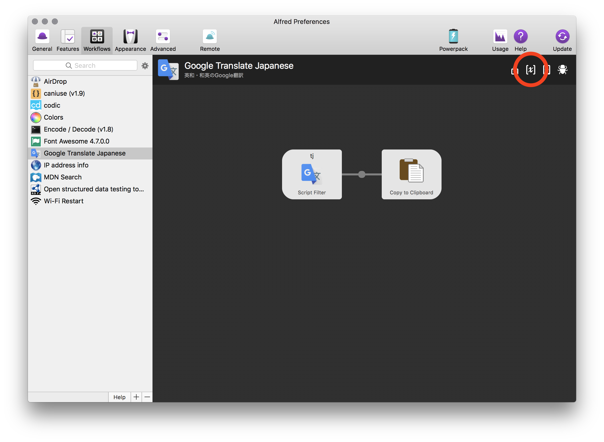
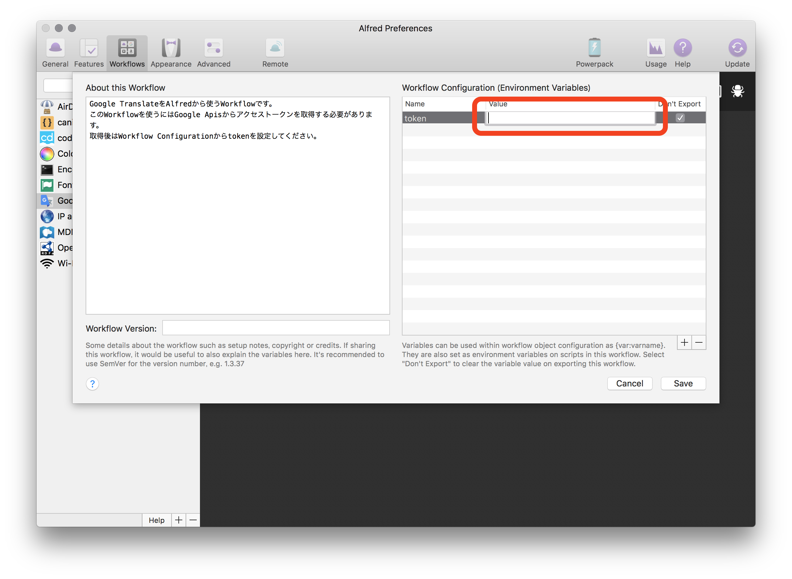

# alfred3-google-translate-ja-workflow
Google翻訳（Cloud Translation API）で英和・和英の翻訳をするalfred3のworkflow

[Download](https://github.com/resessh/alfred3-google-translate-ja-workflow/releases/download/v1.0/Google.Translate.Japanese.alfredworkflow)

## How to use
1. [Google API Console](https://console.cloud.google.com/apis) からTranslation APIを有効にする
2. api tokenを Workflow Configuration に追加する
  
  

## How to develop
1. `cd path/to/project`
2. `pip install requests -t .`
